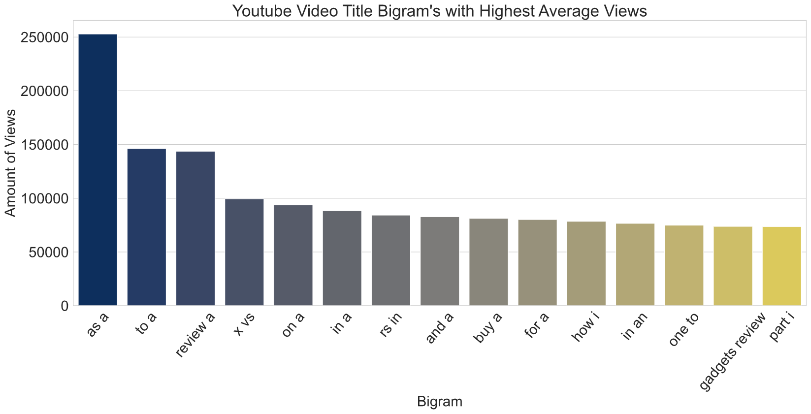
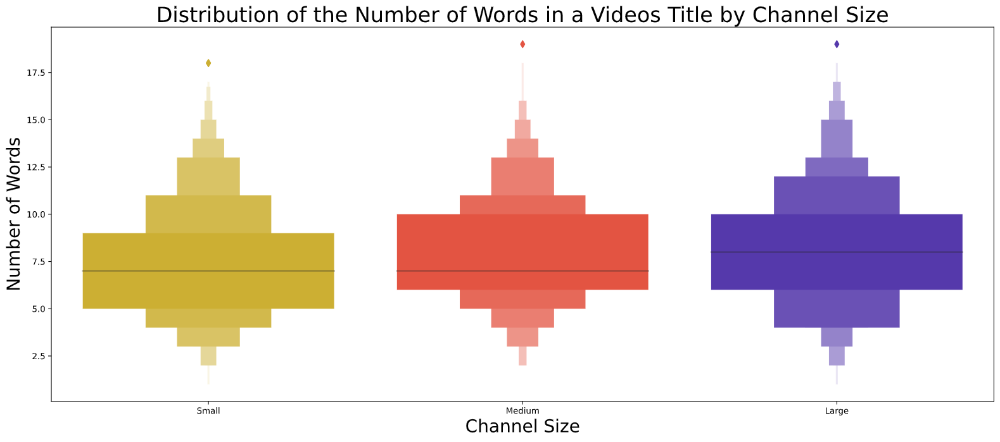
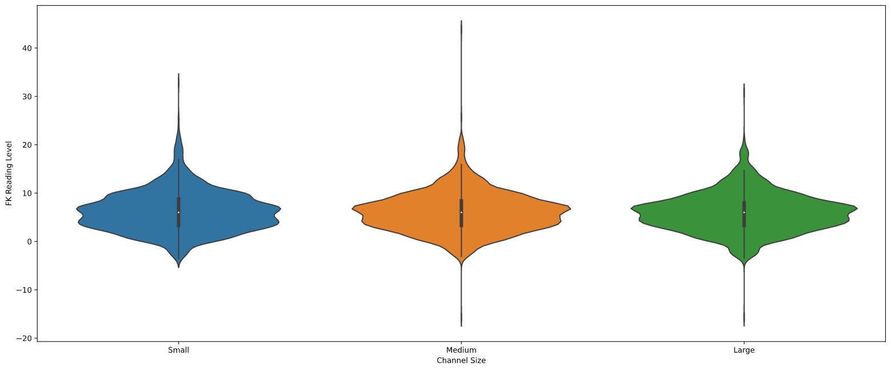

# YouTube Video Title Language Analysis
This analysis provides insight as to what kind of language in a science & technology YouTube video title yields the most viewers. This was achieved by scraping data from thousands of YouTube videos and going through exploratory data analysis on the language of a video title and its direct impact on the amount of views.

## Code and Resources Used
**Python Version:** 3.6 <br>
**Packages:** Pandas, Langdetect, NLTK, Seaborn, Matplotlib, Heapq, Itertools, Textstat, Selenium

## Data
Any data used for this analysis can be found in the data directory:
```bash
cd ./data
```

## Web Scraping
All video scraping scripts can be accessed by navigating to the scraping_data directory:
```bash
cd ./scraping_data
```

The web scrapping scripts gather data from a list of science & technology YouTubers. The data that was collected was:
- Channel Name
- Channel Subscribers
- Video Link
- Video Views
- Video Likes
- Video Dislikes
- Video Description

## Data Cleaning
The data cleaning was included in the youtube_title_data_analysis.ipynb file's first section. The data was cleaned by:
- Removing non-english titles
- Removing any channel names in the title
- Removing symbols such as emojis and punctuation
- Removing any outliers

## Exploratory Data Analysis
The goal of the data analysis was to provide insight as to what kind of language in the video title yielded the highest amount of views. The first approach was to analyze the bigrams that had the highest amount of views. I compared the different types of bigrams that had the most views on average from the entire dataset to the bigrams of small, medium, and large YouTube channels. I also tried to get insight as to what title length would yielded the highest amount of views on average for the different channel sizes. Lastly, I looked to see if there was any correlation between the readability of the titles and the amount of views using the Flesch–Kincaid readability tests.

This graph shows the bigrams with the highest views on average from the entire dataset


This graph shows the distribution of the average word count in the videos title from three different channel sizes


This graoh shows the average reading level in the video titles from three different channel sizes


## Results
After analyzing the data and retrieving insight from the data, I found the following results:
- Optimal title word count can be derived from the size of ones channel
- Review videos, bitcoin mining videos, coding tutorials, and video editing tutorials bring in the most views regardless of channel size
- A long specific video title brings in views regardless of channel size
- video title readability isn't a factor in optimizing video views

The full report on my analysis can be found [here](https://github.com/HectorENevarez/YT-Title-Analysis/blob/main/Report.pdf)
